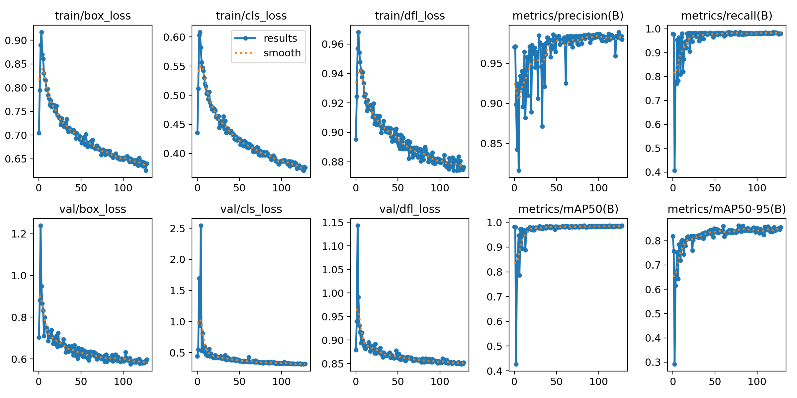
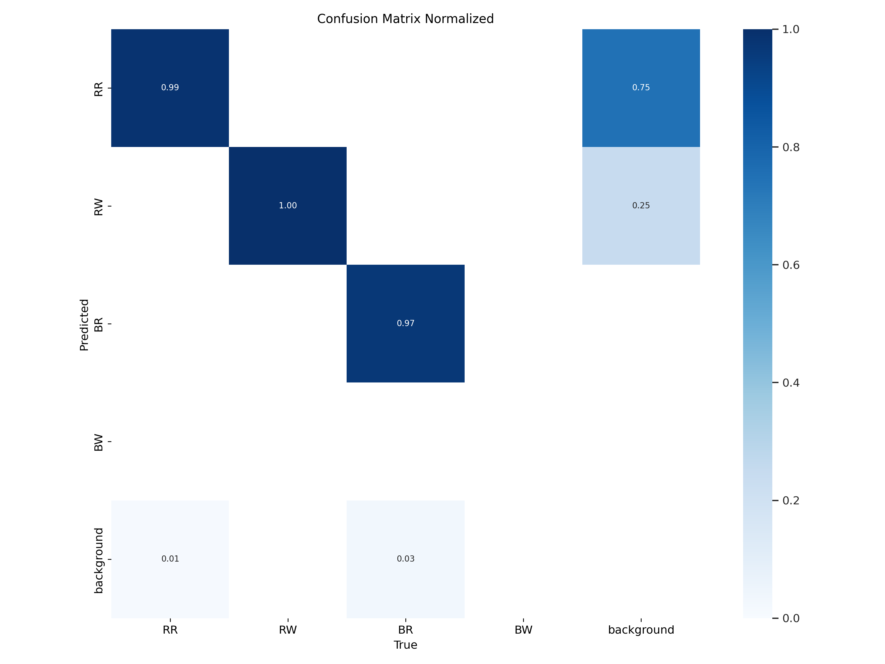

# ARTINX2023能量机关识别
## 项目依赖
+ OpenCV
+ CMake
+ g++
+ OpenVino2022
## 代码实现思路
由于本赛季更新的能量机关待击打扇叶中间有一坨奇怪的东西，在尝试取中间小圆、模板匹配、hsv分离取外接圆等方法均没有明显成果的情况下，我们最终选择了尝试将其通过灰度阈值滤掉。然鹅，已击打扇叶的边框灯条亮度与这坨奇怪的东西十分接近，直接拉高二值化阈值很可能导致无法区分已击打/未击打扇叶，所以我们的最终实现思路分为两部分：待击打扇叶ROI提取，给传统视觉处理获得待击打扇叶的关键点和R标的ROI。

## 识别过程
##### 神经网络的训练
+ 将ultralytics (yolov8) 的模型yolov8的骨干网络修改为对CPU更加友好的shuffleBlock等网络结构，获得energy-v8-noKpt.yaml的模型，利用低曝光的符的数据集来训练。
+ 目前使用的神经网络的重要超参数：
  + imgSzie = 416, 416
  + classes = 4 (0: 红色待击打 1：红色已击打 2：蓝色待击打 3：蓝色未击打 目前数据集无蓝色未击打的数据)
+ 神经网络的输入输出
  + 输入：imgSize * 3
  + 输出：1* (4 + 4) * (52*52 + 26*26 + 13*13) 即nms前的imgSize / 8, imgSize / 16 , imgSize / 32的平方和个数的anchor的4个参数x, y, w, h.
+ 目前使用的网络energy-v8-noKpt
  + size: 416 
  + speed(cpu onnx): 7ms 
  + params: 11.085 M 
  + FLOPs: 62.313 M

##### 神经网络的推理
+ 获得 .pt的权重文件后，使用ultralytics集成的命令，将其导出为 .onnx的权重文件，在符的识别程序中使用openvino2022来读取 .onnx。目前使用的网络未经过nms，便要在获得网络输出后进行nms。
+ 输出的格式解析见代码NnetInference.cpp。

##### 角点提取
+ 获得扇叶ROI后，事情变得简单了起来。我们可以直接对ROI内的彩色图直接二值化，滤去中间的奇怪图案后取面积最大的两个轮廓。可以发现，此时这两个轮廓一定是可击打部分的上下边框（上边框可能和箭头混在一起，但因为我们只关心离下边框近的那条边所以不影响）。取得这两个矩形后，分别取每一个矩形的所有顶点中里离另一个矩形中心更近的两个点作为关键点，这样我们就取得了pnp需要四点坐标。之后使用向量叉乘规范顺序即可。
  
##### R标提取
+ 相比起最小二乘取圆心，直接获取R标的位置显然对之后的拟合更友好。因此，R标的提取是有必要的。（除非你可以说服自己or做拟合的队友去最小二乘 ( )）

+ 上文提到，我们已经基于上下边框获取到了四个关键点；不难发现，R标刚好在上下边框中点连线的延长线上。

+ 获取到四个关键点后，我们能够很轻松地求出 来自上边框的两个关键点的中点 和 来自下边框的两个关键点的中点。两者相减再乘以一定的系数，我们能够得到R标的大概位置。在此位置取个小小的ROI，再取ROI中面积最大的轮廓中心即可（注：你可能会发现有时“最大轮廓”并不能帮助你完美地找到R标，因为当“大概位置”抖的太厉害时其他扇叶的部分轮廓会被包括进ROI。这时，可以考虑将所有与ROI边界相交的轮廓滤掉）
  
##### pnp结算
+ 朴实无华的pnp，将上述四个点扔进去即可。如果你/你的队友要求比较高，想要R标的世界坐标系位置，可以把R标也扔进去。
  
## 存在的问题
##### 二值化存在的问题
二值化的参数为固定参数，环境光照一改变，需要重新调整，由于神经网络找到的ROI里，很明显的可以发现有两块亮度峰值较高的扇叶，因此肯定存在自适应的算法能解决该调参问题。

##### 神经网络的问题
+ 由于无蓝色未击打的数据集，且imgSize较小，如果在击打大符时击中10环，会把10环识别为待击打扇叶（即使已经进行处理，使得待击打扇叶只能有一个，仍可能出现该问题。这意味着10环被看起来更像是待击打的扇叶）