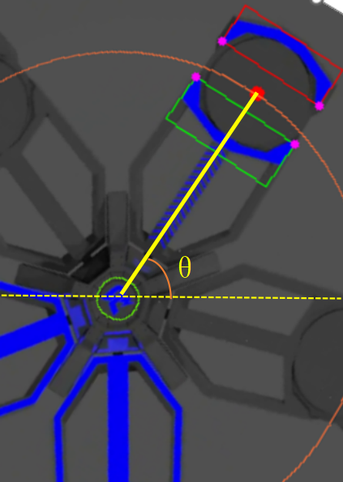
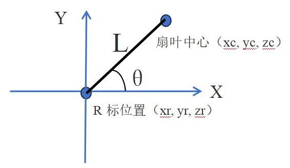
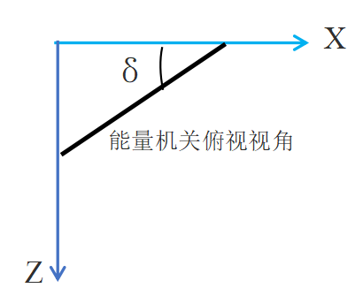

# ARTINX2023能量机关预测算法
在识别到能量机关扇叶的四个关键点和R标中心点在图像中的坐标后，假设打符车正对着能量机关，那么通过四个关键点计算出待击打扇叶中心坐标，在结合R标中心点的坐标，即可算出待击打扇叶与水平线夹角θ。

求该θ角后，在通过PNP算法的平移向量tvec算得扇叶中心在车辆惯性系下的位置xc，yc，zc，通过旋转向量rvec算出扇叶在惯性系下的yaw角δ，如下图所示，基于以上观测量，坐标系采用OpenGL右手系，车辆枪口朝向为Z轴负方向，建立状态转移方程和观测方程：

状态转移方程选取的状态量X=[t, w, θ，xr, yr, zr]，其中w为能量机关扇叶角速度由于能量机关R标中心点在惯性系下一直不变，因此其状态转移方程为

t(k+1)= t(k) + dt
w(k+1)= w(k) (小能量机关)
w(k+1)= a \* sin( b\*t(k) + ɸ) + c (大能量机关)
θ(k+1)= w(k) \* dt
xr(k+1)= xr(k)
yr(k+1)= yr(k)
zr(k+1)= zr(k)
观察量 Z=[θ, xr, yr, zr, δ],建立观测方程
xr= xc + L \* cos(θ) \* cos(δ)
yr= yc + L \* sin(θ)
zr= zc + L \* cos(θ) \* sin(δ)

其中L为扇叶中心到R标的距离，由此得到状态转移方程和观测方程，带入拓展卡尔曼滤波算法中进行预测和观测。值得注意的是，小符由于参数已知，得到观测量后可以直接进行预测击打，大符参数未知，在进行拓展卡尔曼滤波算法前，需要对参数进行拟合。

由于对角速度的计算存在较大的噪声，对角速度拟合参数较为困难。因此，对角速度进行积分，得到角度为一个余弦函数，对该余弦函数的参数进行拟合。在计算出能量机关扇叶的θ后，将观测出来的连续的20帧θ送进Cere库中，进行最小二乘拟合，出来拟合参数后进行拓展卡尔曼滤波预测击打。
