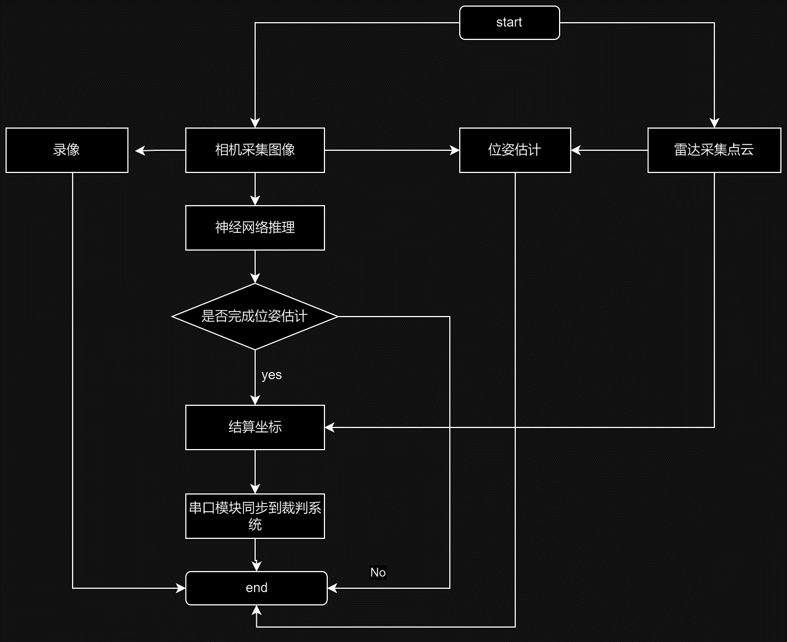
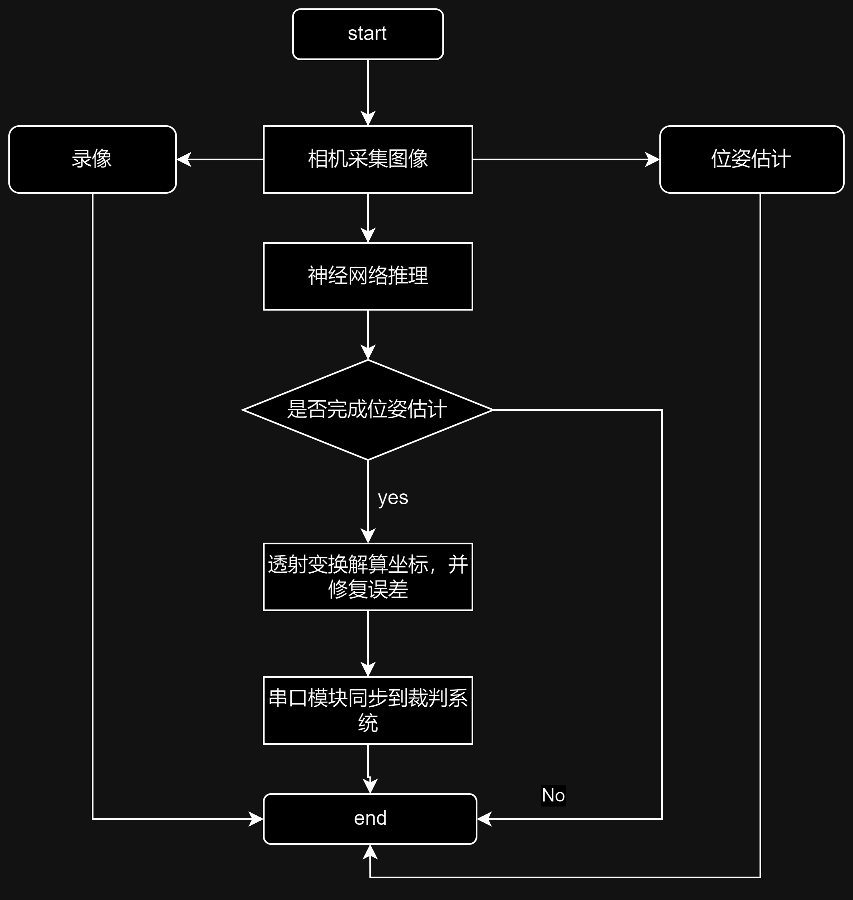

# ARTINX2023雷达
#### 计划流程图

#### 2023赛季实际1流程图

***本文档只讲思路，代码相关看仓库里的doc/radar.md***

##### 本赛季细节
+ 位置解算（纯相机）：通过投射变换将相机所拍摄的视角转换为正上方二维地图视角（什么是[透射变换](https://sjtu-robomaster-team.github.io/vision-learning-9-projection/)）

##### 需要注意的问题
+ 由于是重投影，不在同一平面的物体会被投影到远处，因此需要对高度不为零的区域手动修正（环高，梯高等）
+ 位姿估计选点时需要选同一平面的点（好像能解三维，但是没试）

神经网路：根据大疆19年开源的数据集训练的yolov7模型，有两个，一次为2000张一次为12000张，各训练300epoch，使用tensorrt推理，具体看markdown

单层网络一次识别效果不行，建议使用一层网络识别车辆（一定要识别颜色，红车蓝车），一层在roi上做id识别（识别装甲板图案）

##### 未实现细节
关于滤波/跟踪器：建议使用线性卡尔曼滤波器进行位置结算的后处理，（[什么是卡尔曼滤波器](https://www.cnblogs.com/leexiaoming/p/6852483.html)）

##### 关于雷达
库存型号为Livox horizon*11+Livox mid40*1，[官方SDK](https://github.com/Livox-SDK/Livox-SDK)

##### 相机雷达标定算法
官方：[Livox-SDK/livox_camera_lidar_calibration: Calibrate the extrinsic parameters between Livox LiDAR and camera (github.com)](https://github.com/Livox-SDK/livox_camera_lidar_calibration)

港科大：[ankitdhall/lidar_camera_calibration: ROS package to find a rigid-body transformation between a LiDAR and a camera for "LiDAR-Camera Calibration using 3D-3D Point correspondences" (github.com)](https://github.com/ankitdhall/lidar_camera_calibration)

##### 关于雷达站自身位置估算
参考上交开源（见下）的方法使用pnp估算相机外参，前端已经写好，丑但是能用

##### 其他开源资料
+ **数据集：**
[SCAU-RM-NAV/RM2023_Radar_Dataset: 该仓库为RM2023雷达站所用到的yolo神经网络训练数据集，包含车和装甲板（上交格式）。同时有yolov5 6.0的训练环境，可以在本地进行训练和测试 (github.com)](https://github.com/SCAU-RM-NAV/RM2023_Radar_Dataset)
战队nas里面有rm视觉开源站的，但大多操作手第一视角（太近了），建议从23赛季雷达新开源资料开练
+ **雷达站开源（文档）：**
[RM2023 沈阳航空航天大学TUP战队 雷达站算法开源【RoboMaster论坛-科技宅天堂】](https://bbs.robomaster.com/forum.php?mod=viewthread&tid=22634)
[RM2022 南京航空航天大学长空御风 雷达站开源【RoboMaster论坛-科技宅天堂】](https://bbs.robomaster.com/forum.php?mod=viewthread&tid=22159)
[Livox激光雷达 南京航空航天大学 RM2022开源【RoboMaster论坛-科技宅天堂】](https://bbs.robomaster.com/forum.php?mod=viewthread&tid=22153)
[【南航 视觉开源】RadarDisplayer——一个雷达站前端项目【RoboMaster论坛-科技宅天堂】](https://bbs.robomaster.com/forum.php?mod=viewthread&tid=21788)
[RM2021-上海交通大学-云汉交龙战队-雷达站算法部分开源【RoboMaster论坛-科技宅天堂】](https://bbs.robomaster.com/forum.php?mod=viewthread&tid=12239)
+ **雷达站开源（代码）：**
[COMoER/LCR_sjtu: 上海交通大学云汉交龙战队21赛季雷达站程序开源 (github.com)](https://github.com/COMoER/LCR_sjtu)
[nuaa-rm/radar_station2022: 南京航空航天大学 长空御风 RoboMatser2022雷达站 (github.com)](https://github.com/nuaa-rm/radar_station2022)
[hoshino-lr/hitsz_radar_2022: 哈尔滨工业大学（深圳）-2022赛季雷达站-南工骁鹰战队 (github.com)](https://github.com/hoshino-lr/hitsz_radar_2022)
[tup-robomaster/RM_Radar2023: 沈阳航空航天大学TUP战队 2023赛季雷达程序 (github.com)](https://github.com/tup-robomaster/RM_Radar2023)